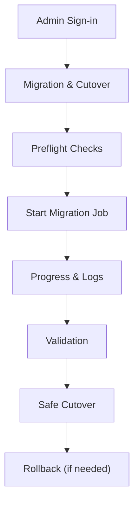

## 1. Product Overview
An admin-only page to run a controlled migration from an old Postgres database into the current Postgres database, then safely cut over the application’s DB connection.
It minimizes downtime and risk via preflight checks, job progress visibility, and guarded cutover/rollback actions.

## 2. Core Features

### 2.1 User Roles
| Role | Registration Method | Core Permissions |
|------|---------------------|------------------|
| Admin | Existing admin authentication (SSO/email/password) | Can run migration jobs, view progress/logs, execute cutover/rollback |

### 2.2 Feature Module
Our admin migration requirements consist of the following main pages:
1. **Admin Sign-in**: admin authentication, session creation, access guard.
2. **Migration & Cutover**: preflight checks, start migration, live status/logs, validate results, perform safe cutover, rollback.

### 2.3 Page Details
| Page Name | Module Name | Feature description |
|-----------|-------------|---------------------|
| Admin Sign-in | Authentication | Authenticate admin and create session.
| Admin Sign-in | Access Guard | Redirect non-admin users away from migration tools.
| Migration & Cutover | Context Summary | Show source (old DB) and target (current DB) identifiers (non-secret) and last migration status.
| Migration & Cutover | Preflight Checks | Run connectivity + schema compatibility + permissions checks; block start if failed; show actionable errors.
| Migration & Cutover | Start Migration | Trigger an idempotent migration job (supports resume); require explicit confirmation (e.g., typing a phrase).
| Migration & Cutover | Progress & Logs | Display job state (queued/running/failed/succeeded), phase, counts, duration; stream/poll logs.
| Migration & Cutover | Validation | Run post-migration consistency checks (row counts/checksums for key tables); show pass/fail.
| Migration & Cutover | Safe Cutover | Place app into maintenance/read-only mode, run final incremental sync, then swap app DB connection; show health checks and completion criteria.
| Migration & Cutover | Rollback | If cutover fails, revert app DB connection to previous config and exit maintenance mode.

## 3. Core Process
**Admin Flow**
1. Sign in as an admin.
2. Open Migration & Cutover.
3. Run preflight checks and review results.
4. Start migration job; monitor progress and logs.
5. Run validation; if validation passes, proceed.
6. Execute safe cutover: enable maintenance/read-only, perform final sync, swap app DB connection, verify health, disable maintenance.
7. If issues are detected after cutover, execute rollback.

