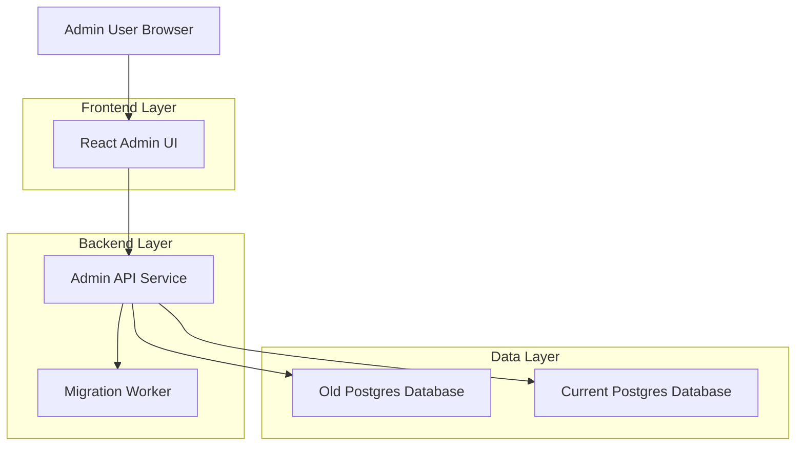
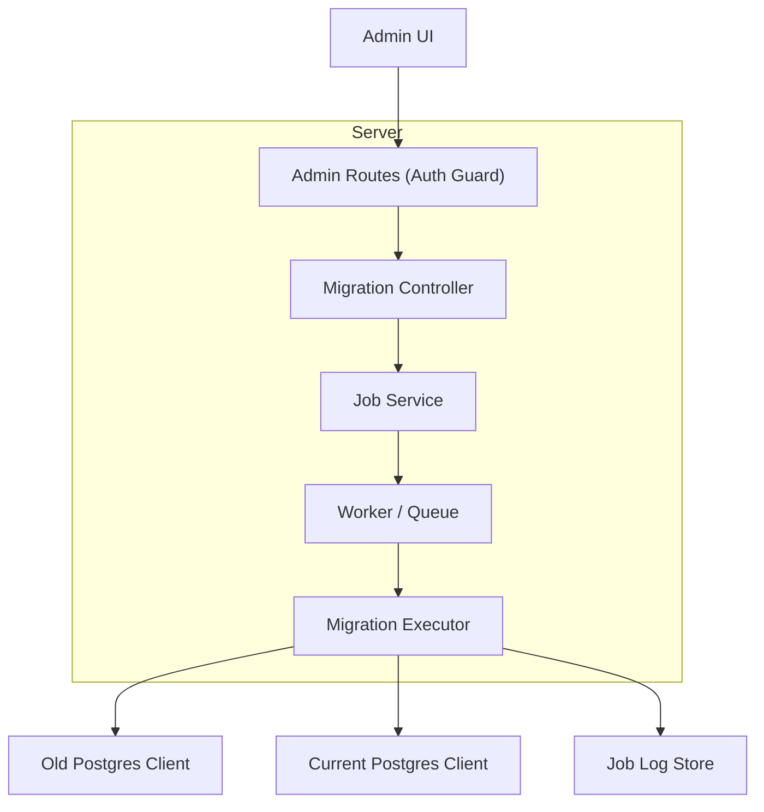
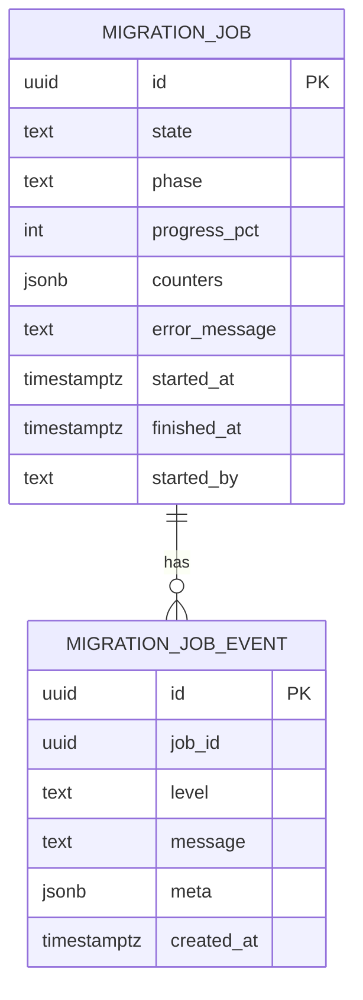

## 1.Architecture design


## 2.Technology Description
- Frontend: React@18 + TypeScript + (tailwindcss or existing design system)
- Backend: Node.js + Express (or Next.js API routes) + TypeScript
- Database: Postgres (old source + current target)
- DB Connectivity (backend only): node-postgres (pg)

## 3.Route definitions
| Route | Purpose |
|-------|---------|
| /admin/login | Admin sign-in page (or redirect to existing SSO) |
| /admin/migration | Admin migration & cutover console |

## 4.API definitions (If it includes backend services)

### 4.1 Core API
Preflight
```
POST /api/admin/migration/preflight
```
Response (example types)
```ts
type PreflightResult = {
  ok: boolean;
  checks: { name: string; ok: boolean; message?: string }[];
};
```

Start job
```
POST /api/admin/migration/start
```
Request
```ts
type StartMigrationRequest = {
  mode: "full" | "incremental";
  confirmText: string; // must match required phrase
};
```
Response
```ts
type StartMigrationResponse = { jobId: string };
```

Get job status
```
GET /api/admin/migration/jobs/:jobId
```
Response
```ts
type MigrationJobStatus = {
  jobId: string;
  state: "queued" | "running" | "failed" | "succeeded";
  phase:
    | "preparing"
    | "copying"
    | "incremental_sync"
    | "validating"
    | "ready_for_cutover"
    | "cutover"
    | "done";
  progressPct?: number;
  counters?: Record<string, number>; // e.g., rowsCopiedByTable
  startedAt?: string;
  finishedAt?: string;
  errorMessage?: string;
};
```

Cutover
```
POST /api/admin/migration/cutover
```
Request
```ts
type CutoverRequest = {
  jobId: string;
  confirmText: string;
};
```

Rollback
```
POST /api/admin/migration/rollback
```
Request
```ts
type RollbackRequest = {
  reason: string;
  confirmText: string;
};
```

### 4.2 Security (backend enforced)
- Require authenticated admin session for all `/api/admin/migration/*` routes.
- Store old/current DB credentials only in backend environment/secret store.
- Log every start/cutover/rollback action with actor identity and timestamp.

## 5.Server architecture diagram (If it includes backend services)


## 6.Data model(if applicable)

### 6.1 Data model definition


### 6.2 Data Definition Language
Migration Jobs (migration_jobs)
```
CREATE TABLE migration_jobs (
  id UUID PRIMARY KEY DEFAULT gen_random_uuid(),
  state TEXT NOT NULL CHECK (state IN ('queued','running','failed','succeeded')),
  phase TEXT NOT NULL,
  progress_pct INT,
  counters JSONB DEFAULT '{}'::jsonb,
  error_message TEXT,
  started_by TEXT,
  started_at TIMESTAMPTZ DEFAULT NOW(),
  finished_at TIMESTAMPTZ
);

CREATE INDEX idx_migration_jobs_started_at ON migration_jobs(started_at DESC);
```

Migration Job Events (migration_job_events)
```
CREATE TABLE migration_job_events (
  id UUID PRIMARY KEY DEFAULT gen_random_uuid(),
  job_id UUID NOT NULL,
  level TEXT NOT NULL CHECK (level IN ('debug','info','warn','error')),
  message TEXT NOT NULL,
  meta JSONB DEFAULT '{}'::jsonb,
  created_at TIMESTAMPTZ DEFAULT NOW()
);

CREATE INDEX idx_migration_job_events_job_id_created_at ON migration_job_events(job_id, created_at);
```

## Cutover safety (implementation notes)
- Use a single “global cutover lock” (e.g., Postgres advisory lock) so only one migration/cutover runs at a time.
- Prefer an idempotent, restartable migration (track high-water marks per table or updated_at).
- Safe cutover sequence: enable maintenance/read-only → drain writes → final incremental sync → validate → swap DB connection secret/config → rolling restart + health checks → disable maintenance.
- Rollback sequence: re-point DB connection to previous config → rolling restart + health checks → disable maintenance.