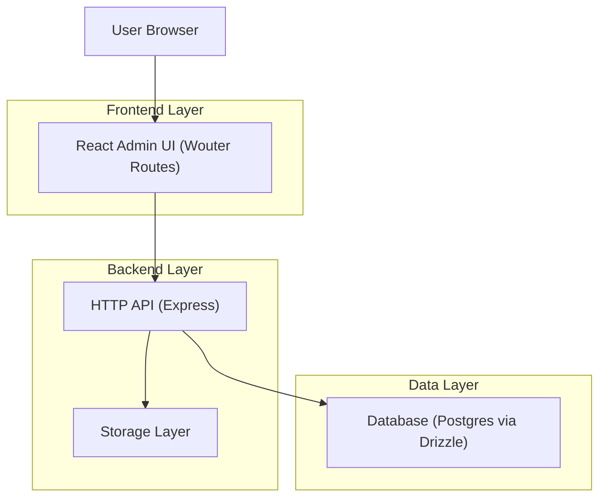

## 1.Architecture design


## 2.Technology Description
- Frontend: React@18 + wouter + @tanstack/react-query + react-hook-form + zod + tailwindcss@3 + shadcn/ui
- Backend: Express@4 (TypeScript) + session auth middleware
- Database: Postgres + drizzle-orm

## 3.Route definitions
| Route | Purpose |
|---|---|
| /login | Admin authentication entry point |
| /admin/seo | Unified SEO admin page (replaces separate SEO Settings + SEO Enhanced pages) |
| /admin/seo/enhanced | Legacy route; should redirect to /admin/seo for continuity |

## 4.API definitions (If it includes backend services)
### 4.1 Notes on existing issues to debug (must be fixed)
- Several “enhanced” list endpoints return `{ dataKey, pagination }` objects (e.g., `{ metaTags, pagination }`), while the current admin UI reads them as arrays; this must be aligned so the unified page never crashes.
- Sitemap exists in multiple places (`/sitemap.xml` and API endpoints); the unified UI must use a single canonical sitemap URL and reflect it consistently.

### 4.2 Core Types (shared contracts)
```ts
type Pagination = { page: number; limit: number; total: number; totalPages: number };

type PaginatedResponse<T, K extends string> = Record<K, T[]> & { pagination: Pagination };

type SeoSettingsBase = {
  siteName: string;
  siteDescription: string;
  ogImage?: string;
  metaKeywords?: string;
};

type SeoSettingsEnhanced = SeoSettingsBase & {
  enableAutoSitemapSubmission?: boolean;
  enableSchemaMarkup?: boolean;
  enableHreflang?: boolean;
  enableABTesting?: boolean;
  defaultLanguage?: string;
  robotsTxt?: string;
  enableLocalSEO?: boolean;
  businessName?: string;
  businessAddress?: string;
  businessPhone?: string;
  businessEmail?: string;
  businessHours?: string;
  latitude?: number;
  longitude?: number;
};
```

### 4.3 Minimal endpoint set the unified page relies on
- Settings
  - `GET /api/seo/settings`
  - `PATCH /api/seo/settings` (auth)
  - `GET /api/seo/enhanced/settings`
  - `PATCH /api/seo/enhanced/settings` (auth)
- Entities (paginated list shape)
  - `GET /api/seo/enhanced/meta-tags` -> `PaginatedResponse<MetaTag, "metaTags">`
  - `GET /api/seo/enhanced/redirects` -> `PaginatedResponse<Redirect, "redirects">`
  - `GET /api/seo/enhanced/keywords` -> `PaginatedResponse<Keyword, "keywords">`
  - `GET /api/seo/enhanced/audits` -> `PaginatedResponse<AuditResult, "audits">` (or consistent key)
- Sitemap (dynamic)
  - Canonical public URL: `GET /sitemap.xml`
  - Optional API generation URL (if you keep it): `GET /api/seo/enhanced/sitemap`

## 5.Server architecture diagram (If it includes backend services)
```mermaid
graph TD
  A["React Admin UI"] --> B["SEO Routes (Express Router)"]
  B --> C["Storage Services"]
  B --> D["Drizzle Repos"]
  D --> E["Postgres"]

  subgraph "Server"
