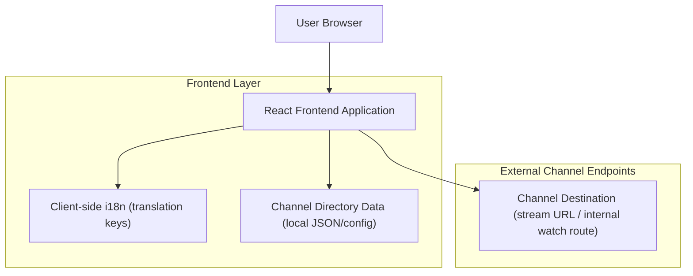

## 1.Architecture design


## 2.Technology Description
- Frontend: React + react-router + i18n library (e.g., i18next/react-i18next) + tailwindcss
- Backend: None

Channel directory data is maintained as a versioned, frontend-readable data source (e.g., `channels.json`) containing all channel links and display metadata.

## 3.Route definitions
| Route | Purpose |
|-------|---------|
| / | Home page with localized top menu entry point |
| /channels | Netflix-style Channels directory listing all channel links |
| /channels/:channelSlug | Channel Watch page for the selected channel (or redirects/opens the channel link) |

## 4.Data shape (frontend)
TypeScript shape for channel directory items:
```ts
export type Channel = {
  id: string;
  slug: string;
  name: string;
  logoUrl?: string;
  thumbnailUrl?: string;
  category?: string; // optional; used to create Netflix-style rails
  href: string; // destination link (internal or external)
};
```

## 5.Localization notes (frontend)
- Add a single translation key for the nav item and page title (e.g., `nav.channels`).
- English value: `Channels`.
- Target locale value: `Kanali`.
