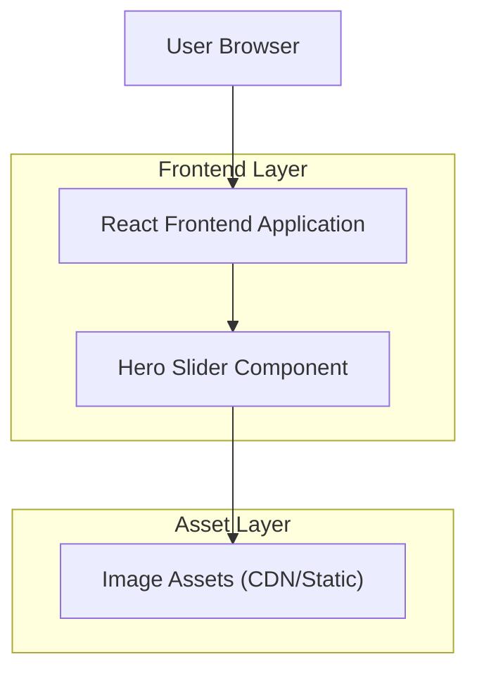

## 1.Architecture design

## 2.Technology Description
- Frontend: React@18 + TypeScript + vite
- Backend: None

## 3.Route definitions
| Route | Purpose |
|-------|---------|
| / | Home page containing the Netflix-style hero slider |

## 4.API definitions (If it includes backend services)
N/A (no backend required).

## 5.Server architecture diagram (If it includes backend services)
N/A.

## 6.Data model(if applicable